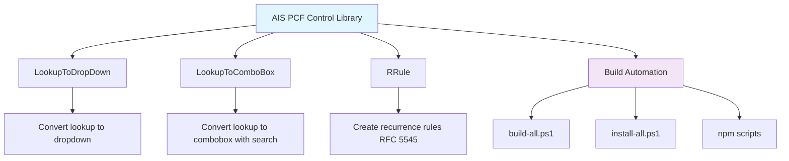

# AIS PCF Control Library

Sponsored by [Applied Information Sciences (AIS)](https://www.ais.com/).

This library provides a collection of reusable Power Apps Component Framework (PCF) controls. Our goal is to offer robust and easy-to-use components to enhance Power Apps development.



## Current Controls

This library currently includes the following controls:

### LookupToDropDown
Converts a lookup field into a dropdown control for better user experience in scenarios where the related records are limited and known.

### LookupToComboBox  
Converts a lookup field into a combobox control, providing search functionality while maintaining the lookup relationship.

### RRule
A control for creating and editing recurrence rules (RRule) following the RFC 5545 specification, commonly used for scheduling recurring events.

## Prerequisites

Before you begin, ensure you have the following installed:

*   [Node.js](https://nodejs.org/) (which includes npm)
*   [Microsoft Power Platform CLI](https://docs.microsoft.com/en-us/powerapps/developer/component-framework/get-powerapps-cli)

## Setup

1.  **Clone the repository** (if applicable, once it's on a version control system):
    ```bash
    git clone <repository-url>
    cd PCFControls
    ```
2.  **Install dependencies for all controls** (recommended):
    Use the provided automation script to install dependencies for all controls at once:
    ```bash
    npm run install:all
    ```
      Alternatively, you can install manually by navigating into each control's subdirectory (e.g., `LookupToDropDown`, `LookupToComboBox`, `RRule`) and running `npm install`.

## 🚀 Quick Start - Deployment Status

**✅ FULLY DEPLOYED**: The AIS PCF Control Library is successfully deployed with all controls!

- **Environment**: https://org5ecd402c.crm.dynamics.com
- **Solution**: AISPCFControls v1.0 (Managed)
- **Status**: All 3 controls verified and available
- **Last Updated**: June 6, 2025

**Issue Resolved**: Fixed LookupToDropDown control deployment issue by correcting nested directory structure and updating build automation.

### All Controls Available

✅ **AIS.LookupToDropDown** - Convert lookup fields to dropdown controls  
✅ **AIS.LookupToComboBox** - Convert lookup fields to searchable combo boxes  
✅ **AIS.RRule** - Recurrence rule editor for scheduling events

### Using the Controls

The controls are now available in your Power Platform environment:

**For Canvas Apps:**
1. Go to [make.powerapps.com](https://make.powerapps.com)
2. Create or edit a Canvas app
3. Insert > Get more components > Code components
4. Look for: `AIS.LookupToDropDown`, `AIS.LookupToComboBox`, `AIS.RRule`

**For Model-driven Apps:**
1. Open form designer in solution explorer
2. Add/edit a field on the form
3. Change the control type to "Custom"
4. Select the appropriate AIS control

### Quick Deployment to Other Environments

```powershell
# Deploy to your environment
.\deploy-all.ps1 -EnvironmentUrl "https://your-environment.crm.dynamics.com"

# Verify deployment  
.\verify-deployment.ps1 -EnvironmentUrl "https://your-environment.crm.dynamics.com"
```

## Building Controls

### Building Individual Controls

To build an individual control:

1.  Navigate to the control's directory:
    ```bash
    cd <ControlName>
    ```
    (e.g., `cd LookupToDropDown`)
2.  Run the build command:
    ```bash
    npm run build
    ```
    To watch for changes and rebuild automatically during development:
    ```bash
    npm start watch
    ```

### Building All Controls

For convenience, you can build all controls at once using the provided automation scripts:

#### Using npm scripts (recommended):
```bash
# Build all controls
npm run build:all

# Build all controls with watch mode (opens separate terminal for each)
npm run build:all:watch

# Clean and build all controls
npm run build:all:clean

# Install dependencies for all controls
npm run install:all

# Clean output directories for all controls
npm run clean:all
```

#### Using PowerShell directly:
```powershell
# Build all controls
./build-all.ps1

# Build with watch mode
./build-all.ps1 -Watch

# Clean before building
./build-all.ps1 -Clean
```

#### Using batch file (Windows):
```cmd
build-all.bat
```

The build scripts will automatically detect all PCF control directories and build them sequentially, providing a summary of successes and failures.

**How the automation works:**
- Scripts automatically discover all PCF control directories (folders containing `package.json` and a matching subdirectory)
- Each control is built in sequence with progress tracking and colored output
- Summary report shows total successes/failures
- Watch mode opens separate terminal windows for each control for parallel development

## Deploying Controls to Power Platform Environment

After building your controls, you need to package them into a Power Apps solution and deploy to your environment. Here are several approaches:

### Option 1: Create Individual Solution for Each Control

This approach creates separate solutions for each control, allowing independent deployment and versioning.

1. **Navigate to a control directory:**
   ```powershell
   cd LookupToDropDown
   ```

2. **Create a solution project:**
   ```powershell
   pac solution init --publisher-name "AppliedInformationSciences" --publisher-prefix ais
   ```

3. **Add the PCF control to the solution:**
   ```powershell
   pac solution add-reference --path .
   ```

4. **Build the solution:**
   ```powershell
   msbuild /t:build /restore /p:configuration=Release
   ```

5. **Deploy to environment:**
   ```powershell
   # Connect to your environment first
   pac auth create --url https://yourorg.crm.dynamics.com
   
   # Import the solution
   pac solution import --path bin\Release\ais_LookupToDropDown_1_0_0_0_managed.zip
   ```

### Option 2: Create a Combined Solution (Recommended)

This approach creates one solution containing all AIS PCF controls.

1. **Create a Solutions directory:**
   ```powershell
   mkdir Solutions
   cd Solutions
   ```

2. **Initialize the combined solution:**
   ```powershell
   pac solution init --publisher-name "AppliedInformationSciences" --publisher-prefix ais --outputDirectory AISPCFControls
   cd AISPCFControls
   ```

3. **Add all controls to the solution:**
   ```powershell
   # Add each control
   pac solution add-reference --path "..\..\LookupToDropDown"
   pac solution add-reference --path "..\..\LookupToComboBox"  
   pac solution add-reference --path "..\..\RRule"
   ```

4. **Build the combined solution:**
   ```powershell
   msbuild /t:build /restore /p:configuration=Release
   ```

5. **Deploy to environment:**
   ```powershell
   # Connect to your environment
   pac auth create --url https://yourorg.crm.dynamics.com
   
   # Import the solution
   pac solution import --path bin\Release\ais_AISPCFControls_1_0_0_0_managed.zip
   ```

### Option 3: Automated Deployment Script

Create a deployment script for streamlined deployment:

```powershell
# deploy-all.ps1
param(
    [Parameter(Mandatory=$true)]
    [string]$EnvironmentUrl,
    [string]$SolutionName = "AISPCFControls"
)

# Ensure all controls are built
Write-Host "Building all controls..." -ForegroundColor Yellow
npm run build:all

# Create or update solution
if (!(Test-Path "Solutions\$SolutionName")) {
    Write-Host "Creating new solution..." -ForegroundColor Yellow
    mkdir "Solutions\$SolutionName" -Force
    cd "Solutions\$SolutionName"
    pac solution init --publisher-name "Applied Information Sciences" --publisher-prefix ais --outputDirectory .
    
    # Add all controls
    pac solution add-reference --path "..\..\LookupToDropDown"
    pac solution add-reference --path "..\..\LookupToComboBox"
    pac solution add-reference --path "..\..\RRule"
} else {
    cd "Solutions\$SolutionName"
}

# Build solution
Write-Host "Building solution..." -ForegroundColor Yellow
msbuild /t:build /restore /p:configuration=Release

# Connect and deploy
Write-Host "Connecting to environment..." -ForegroundColor Yellow
pac auth create --url $EnvironmentUrl

Write-Host "Importing solution..." -ForegroundColor Yellow
$solutionFile = Get-ChildItem "bin\Release\*.zip" | Select-Object -First 1
pac solution import --path $solutionFile.FullName

Write-Host "Deployment completed!" -ForegroundColor Green
```

### Environment Connection Options

**Connect using interactive login:**
```powershell
pac auth create --url https://yourorg.crm.dynamics.com
```

**Connect using service principal (for CI/CD):**
```powershell
pac auth create --url https://yourorg.crm.dynamics.com --applicationId "your-app-id" --clientSecret "your-secret" --tenant "your-tenant-id"
```

**List available environments:**
```powershell
pac org list
```

### Using the Controls in Power Apps

Once deployed, the controls will be available in:

1. **Canvas Apps:** Go to Insert > Get more components > Code components
2. **Model-driven Apps:** Configure on form fields through form designer
3. **Power Pages:** Available as code components in the portal

### Deployment Best Practices

- **Use managed solutions** for production environments
- **Version your solutions** appropriately (increment version numbers)
- **Test in development environment** before production deployment
- **Document dependencies** if controls require specific configurations
- **Consider security roles** and permissions for the controls

For detailed steps and troubleshooting, refer to the [official Microsoft documentation](https://docs.microsoft.com/en-us/powerapps/developer/component-framework/import-custom-controls).

## Contributing

We welcome contributions! Please see our [CONTRIBUTING.md](CONTRIBUTING.md) file for guidelines on how to contribute new controls or improve existing ones.
